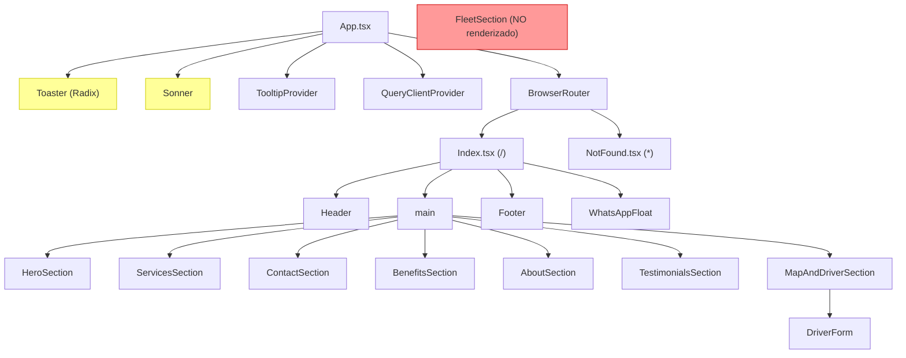

# Documento de Diseno - Auditoria y Mejoras de la Landing Page

## Overview

Este documento describe el diseno tecnico para la auditoria y mejora de la landing page de Central de Taxis Girardot. Se abordan 21 requisitos organizados en tres dimensiones: correcciones criticas, mejoras visuales y mejoras funcionales. El objetivo es eliminar codigo muerto, corregir errores, mejorar SEO, accesibilidad y experiencia de usuario.

### Stack Tecnico Actual

| Capa | Tecnologia |
|------|-----------|
| Framework | React 18 + TypeScript |
| Build | Vite 5 + SWC (`@vitejs/plugin-react-swc`) |
| Estilos | Tailwind CSS 3 con CSS variables (design tokens HSL) |
| Componentes UI | shadcn/ui (Radix primitives + CVA) |
| Routing | react-router-dom v6 (2 rutas: `/` y `*`) |
| Formularios | POST directo a webhooks de Make.com |
| Origen | Generado con Lovable (lovable-tagger en devDependencies) |

### Mapa de Componentes Actual



**Problemas detectados en el mapa:**
- `FleetSection` existe como archivo pero NO se importa ni renderiza en `Index.tsx`.
- Se montan DOS sistemas de toast simultaneamente: `<Toaster />` (Radix) y `<Sonner />`.
- `DriverForm` aplica `section-padding` y `container` propios, duplicando el padding de `MapAndDriverSection`.

---

## Arquitectura

La arquitectura actual es una SPA (Single Page Application) con una unica pagina principal que renderiza secciones en cascada. No hay backend propio; los formularios envian datos directamente a webhooks de Make.com.

### Decisiones de Arquitectura

1. **Mantener la estructura de componentes por seccion**: Cada seccion de la landing es un componente independiente. Esto facilita el mantenimiento y permite reordenar secciones facilmente.

2. **Unificar en Sonner como sistema de toast**: Sonner tiene una API mas simple (`toast("mensaje")` vs el sistema de reducer de Radix Toast). Se eliminara el sistema Radix Toast completo.

3. **Extraer validacion a utilidades compartidas**: La validacion de telefono y fecha/hora se extraera a `src/lib/validation.ts` para reutilizar entre `ContactSection` y `DriverForm`.

4. **Variables de entorno para webhooks**: Las URLs de Make.com se moveran a variables `VITE_*` para evitar exponer endpoints en el codigo fuente y facilitar cambios entre ambientes.

5. **Color primario dual**: Se mantendra `--primary` (amarillo brillante) para fondos/botones y se creara `--primary-text` (amarillo oscuro) para texto sobre fondos claros, cumpliendo WCAG 2.1 AA.

---

## Componentes e Interfaces

### Componentes Modificados

#### Index.tsx (R1, R12)
- **Agregar** import de `FleetSection` y renderizarlo entre `BenefitsSection` y `AboutSection`.
- **Agregar** `pt-16` al elemento `<main>` para compensar el header fijo de 64px.
- Orden final de secciones: Header, HeroSection, ServicesSection, ContactSection, BenefitsSection, **FleetSection**, AboutSection, TestimonialsSection, MapAndDriverSection, Footer, WhatsAppFloat.

#### Footer.tsx (R2, R16)
- **Eliminar** importaciones no usadas: `Car`, `Phone`, `MessageCircle`, `Instagram`, `Twitter`.
- **Renderizar** `quickLinks` como enlaces `<a>` funcionales con `href` apuntando a las secciones.
- **Actualizar** quickLinks para incluir todas las secciones: Inicio, Servicios, Contacto, Beneficios, Flota, Nosotros, Testimonios, Trabaja con nosotros.

#### Header.tsx (R16)
- **Ampliar** `navItems` para incluir todas las secciones visibles:
  ```typescript
  const navItems = [
    { name: "Inicio", href: "#inicio" },
    { name: "Servicios", href: "#servicios" },
    { name: "Contacto", href: "#contacto" },
    { name: "Beneficios", href: "#beneficios" },
    { name: "Flota", href: "#flota" },
    { name: "Nosotros", href: "#nosotros" },
    { name: "Testimonios", href: "#testimonios" },
    { name: "Trabaja con nosotros", href: "#trabaja-con-nosotros" },
  ];
  ```

#### ContactSection.tsx (R11, R18)
- **Reemplazar** clases inline `bg-yellow-400 hover:bg-yellow-500 text-black font-bold border-none` por `variant="call"` en los botones de telefono.
- **Reemplazar** `alert()` por `toast()` de Sonner para notificaciones de exito y error.
- **Agregar** validacion de telefono con regex: `/^\+?[\d\s]{7,15}$/` (minimo 7 digitos).
- **Agregar** revalidacion de fecha/hora al momento del envio (no solo al renderizar).
- **Mover** URL del webhook a `import.meta.env.VITE_WEBHOOK_RESERVA`.

#### DriverForm.tsx (R9, R18)
- **Eliminar** clases `section-padding` y `container` del elemento raiz `<section>`. Cambiar `<section>` por `<div>` ya que el contenedor lo provee `MapAndDriverSection`.
- **Agregar** validacion de telefono con la misma funcion compartida.
- **Actualizar** import de toast: cambiar de `useToast` (Radix) a `toast` de Sonner.
- **Mover** URL del webhook a `import.meta.env.VITE_WEBHOOK_CONDUCTOR`.

#### BenefitsSection.tsx (R13, R4)
- **Cambiar** la tarjeta flotante de estadisticas de `absolute` a responsive: `static` en movil, `sm:absolute` en pantallas >= 640px.
- **Reemplazar** `hover-scale` por `hover:scale-105 transition-transform`.

#### AboutSection.tsx (R4)
- **Reemplazar** `hover-scale` por `hover:scale-105 transition-transform`.

#### WhatsAppFloat.tsx (R14)
- **Verificar** separacion vertical entre botones flotantes. Actualmente Facebook esta en `bottom-36` (144px) y WhatsApp en `bottom-20` (80px), dando 64px de separacion. Esto cumple el minimo de 60px.
- **Ajustar** posicion del menu de WhatsApp para que no se superponga con el boton de Facebook cuando esta abierto.

#### HeroSection.tsx (R20)
- **Agregar** `fetchpriority="high"` al elemento `` de la imagen hero.

#### NotFound.tsx (R19)
- **Traducir** textos al espanol: "Pagina no encontrada", "Volver al inicio".
- **Aplicar** estilos del design system: colores `bg-background`, `text-foreground`, `text-primary`.

#### App.tsx (R7)
- **Eliminar** `<Toaster />` (Radix Toast).
- **Mantener** `<Sonner />` como unico sistema de toast.
- **Eliminar** import de `QueryClientProvider` y `QueryClient` de `@tanstack/react-query` (dependencia no utilizada que se eliminara).
- **Simplificar** el componente eliminando providers innecesarios.

### Archivos Nuevos

#### src/lib/validation.ts (R18)
Funciones de validacion compartidas:

```typescript
/** Valida formato de telefono: minimo 7 digitos, permite +, espacios */
export function isValidPhone(phone: string): boolean {
  const digitsOnly = phone.replace(/[^\d]/g, "");
  return digitsOnly.length >= 7 && digitsOnly.length <= 15 && /^\+?[\d\s]+$/.test(phone);
}

/** Valida que una fecha/hora este al menos 12 horas en el futuro */
export function isAtLeast12HoursAhead(date: string, time: string): boolean {
  const selected = new Date(`${date}T${time}`);
  const minAllowed = new Date(Date.now() + 12 * 60 * 60 * 1000);
  return selected >= minAllowed;
}
```

#### public/sitemap.xml (R17)
```xml
<?xml version="1.0" encoding="UTF-8"?>
<urlset xmlns="http://www.sitemaps.org/schemas/sitemap/0.9">
  <url>
    <loc>https://centraltaxisgirardot.com/</loc>
    <lastmod>2025-01-01</lastmod>
    <priority>1.0</priority>
  </url>
</urlset>
```

#### .env.example (R18)
```
VITE_WEBHOOK_RESERVA=https://hook.us2.make.com/tqhyfy9nhf3tfvqv1kv8sniumndc7f35
VITE_WEBHOOK_CONDUCTOR=https://hook.us2.make.com/38bmevtpcec6rri9jpqx3pzew6sbomn4
```

### Archivos a Eliminar

| Archivo | Razon | Requisito |
|---------|-------|-----------|
| `src/App.css` | Estilos residuales de plantilla Vite, no importado | R3 |
| `src/components/ui/accordion.tsx` | No importado por ningun componente | R6 |
| `src/components/ui/alert-dialog.tsx` | No importado | R6 |
| `src/components/ui/alert.tsx` | No importado | R6 |
| `src/components/ui/aspect-ratio.tsx` | No importado | R6 |
| `src/components/ui/avatar.tsx` | No importado | R6 |
| `src/components/ui/badge.tsx` | No importado | R6 |
| `src/components/ui/breadcrumb.tsx` | No importado | R6 |
| `src/components/ui/calendar.tsx` | No importado | R6 |
| `src/components/ui/carousel.tsx` | No importado | R6 |
| `src/components/ui/chart.tsx` | No importado | R6 |
| `src/components/ui/checkbox.tsx` | No importado | R6 |
| `src/components/ui/collapsible.tsx` | No importado | R6 |
| `src/components/ui/command.tsx` | No importado | R6 |
| `src/components/ui/context-menu.tsx` | No importado | R6 |
| `src/components/ui/dialog.tsx` | No importado | R6 |
| `src/components/ui/drawer.tsx` | No importado | R6 |
| `src/components/ui/dropdown-menu.tsx` | No importado | R6 |
| `src/components/ui/form.tsx` | No importado | R6 |
| `src/components/ui/hover-card.tsx` | No importado | R6 |
| `src/components/ui/input-otp.tsx` | No importado | R6 |
| `src/components/ui/label.tsx` | No importado | R6 |
| `src/components/ui/menubar.tsx` | No importado | R6 |
| `src/components/ui/navigation-menu.tsx` | No importado | R6 |
| `src/components/ui/pagination.tsx` | No importado | R6 |
| `src/components/ui/popover.tsx` | No importado | R6 |
| `src/components/ui/progress.tsx` | No importado | R6 |
| `src/components/ui/radio-group.tsx` | No importado | R6 |
| `src/components/ui/resizable.tsx` | No importado | R6 |
| `src/components/ui/scroll-area.tsx` | No importado | R6 |
| `src/components/ui/select.tsx` | No importado | R6 |
| `src/components/ui/separator.tsx` | No importado | R6 |
| `src/components/ui/sheet.tsx` | No importado | R6 |
| `src/components/ui/sidebar.tsx` | No importado | R6 |
| `src/components/ui/skeleton.tsx` | No importado | R6 |
| `src/components/ui/slider.tsx` | No importado | R6 |
| `src/components/ui/switch.tsx` | No importado | R6 |
| `src/components/ui/table.tsx` | No importado | R6 |
| `src/components/ui/tabs.tsx` | No importado | R6 |
| `src/components/ui/toast.tsx` | Sistema Radix Toast eliminado | R7 |
| `src/components/ui/toaster.tsx` | Sistema Radix Toast eliminado | R7 |
| `src/components/ui/toggle-group.tsx` | No importado | R6 |
| `src/components/ui/toggle.tsx` | No importado | R6 |
| `src/components/ui/use-toast.ts` | Re-export del sistema Radix eliminado | R7 |
| `src/hooks/use-toast.ts` | Hook del sistema Radix eliminado | R7 |
| `src/hooks/use-mobile.tsx` | No importado por ningun componente | R6 |

**Componentes UI conservados:** `button.tsx`, `input.tsx`, `textarea.tsx`, `card.tsx`, `sonner.tsx`, `tooltip.tsx`.

### Assets a Eliminar (R8)

| Archivo | Razon |
|---------|-------|
| `src/assets/passenger-happy.jpg` | No referenciado por ningun componente |
| `src/assets/logo1.png` | Duplicado; se usa `public/logo_taxis_transparente.png` |
| `public/logo2.png` | No referenciado |
| `public/car.svg` | No referenciado (se usa `car.ico`) |
| `public/taxi.ico` | No referenciado (se usa `car.ico`) |
| `public/favicon.ico` | No referenciado (se usa `car.ico`) |
| `public/Gemini_Generated_Image_4z49as4z49as4z49.png` | No referenciado |
| `public/lovable-uploads/429b1394-8e28-4ec0-bf48-2b0aee2b0439.png` | No referenciado |
| `public/placeholder.svg` | No referenciado |

### Dependencias npm a Eliminar (R5)

```
@hookform/resolvers
@radix-ui/react-accordion
@radix-ui/react-alert-dialog
@radix-ui/react-aspect-ratio
@radix-ui/react-avatar
@radix-ui/react-checkbox
@radix-ui/react-collapsible
@radix-ui/react-context-menu
@radix-ui/react-dialog
@radix-ui/react-dropdown-menu
@radix-ui/react-hover-card
@radix-ui/react-label
@radix-ui/react-menubar
@radix-ui/react-navigation-menu
@radix-ui/react-popover
@radix-ui/react-progress
@radix-ui/react-radio-group
@radix-ui/react-scroll-area
@radix-ui/react-select
@radix-ui/react-separator
@radix-ui/react-slider
@radix-ui/react-switch
@radix-ui/react-tabs
@radix-ui/react-toast
@radix-ui/react-toggle
@radix-ui/react-toggle-group
@tanstack/react-query
cmdk
date-fns
embla-carousel-react
input-otp
next-themes
react-day-picker
react-hook-form
react-resizable-panels
recharts
vaul
zod
```

**Conservadas:** `react`, `react-dom`, `react-router-dom`, `lucide-react`, `sonner`, `class-variance-authority`, `clsx`, `tailwind-merge`, `tailwindcss-animate`, `@radix-ui/react-slot`, `@radix-ui/react-tooltip`.

**Nota sobre `next-themes`:** Actualmente importado por `src/components/ui/sonner.tsx`. Al simplificar el componente Sonner (eliminando la dependencia de `useTheme`), se podra eliminar `next-themes` tambien. Se hardcodeara `theme="light"` ya que el sitio no soporta dark mode.

---

## Modelos de Datos

### Datos del Formulario de Reserva (ContactSection)

```typescript
interface ReservaData {
  nombre: string;
  telefono: string;      // Validado: min 7 digitos
  recogida: string;
  destino: string;
  fecha: string;         // Formato YYYY-MM-DD, min 12h en futuro
  hora: string;          // Formato HH:MM
  notas?: string;
  tipo: "reserva";
}
```

### Datos del Formulario de Conductor (DriverForm)

```typescript
interface ConductorData {
  nombre: string;
  apellido: string;
  telefono: string;      // Validado: min 7 digitos
  tipo: "conductor_interesado";
}
```

### Configuracion de Navegacion

```typescript
interface NavItem {
  name: string;
  href: string;  // Formato: #section-id
}
```

### Variables de Entorno

```typescript
// Definidas en .env y tipadas en src/vite-env.d.ts
interface ImportMetaEnv {
  readonly VITE_WEBHOOK_RESERVA: string;
  readonly VITE_WEBHOOK_CONDUCTOR: string;
}
```

### Cambios en CSS Variables (index.css)

```css
:root {
  /* Nuevo: color primario oscuro para texto sobre fondos claros */
  --primary-text: 40 100% 32%;  /* Amarillo oscuro, contraste >= 4.5:1 vs blanco */
}
```

### Cambios en Tailwind Config

```typescript
// tailwind.config.ts - extend
colors: {
  taxi: {
    // ... existentes ...
    "primary-text": "hsl(var(--primary-text))",
  }
},
keyframes: {
  "fade-in": {
    from: { opacity: "0", transform: "translateY(10px)" },
    to: { opacity: "1", transform: "translateY(0)" },
  },
},
animation: {
  "fade-in": "fade-in 0.6s ease-out forwards",
},
```

### Datos Estructurados JSON-LD (R17)

```json
{
  "@context": "https://schema.org",
  "@type": "LocalBusiness",
  "name": "Central de Taxis Girardot",
  "description": "Servicio de transporte rapido, seguro y confiable 24/7 en Girardot",
  "address": {
    "@type": "PostalAddress",
    "streetAddress": "Carrera 4 N. 10 29 Alto de la Cruz",
    "addressLocality": "Girardot",
    "addressRegion": "Cundinamarca",
    "addressCountry": "CO"
  },
  "telephone": ["+573228111111", "+573228331111"],
  "openingHoursSpecification": {
    "@type": "OpeningHoursSpecification",
    "dayOfWeek": ["Monday","Tuesday","Wednesday","Thursday","Friday","Saturday","Sunday"],
    "opens": "00:00",
    "closes": "23:59"
  },
  "url": "https://centraltaxisgirardot.com"
}
```

---

## Propiedades de Correctitud

*Una propiedad es una caracteristica o comportamiento que debe cumplirse en todas las ejecuciones validas de un sistema. Las propiedades sirven como puente entre especificaciones legibles por humanos y garantias de correctitud verificables por maquina.*

### Evaluacion de Aplicabilidad de PBT

Este proyecto es una landing page con formularios. La mayoria de los requisitos son de tipo UI/configuracion/limpieza de codigo, que se verifican mejor con tests de ejemplo, smoke tests o analisis estatico. Sin embargo, hay logica pura de validacion (telefono, fecha/hora) y logica de navegacion que se prestan bien a property-based testing.

**PBT es aplicable para:**
- Validacion de telefono (`isValidPhone`): funcion pura con espacio de entrada grande (strings arbitrarios)
- Validacion de fecha/hora (`isAtLeast12HoursAhead`): funcion pura con espacio de entrada grande (combinaciones de fecha/hora)
- Completitud de navegacion: propiedad universal sobre secciones y enlaces
- Contraste de color: propiedad computable sobre valores HSL

**PBT NO es aplicable para:** eliminacion de archivos, cambios de configuracion, traducciones, preload de assets (se verifican con smoke tests y tests de ejemplo).

---

### Property 1: Validacion de telefono acepta formatos validos y rechaza invalidos

*Para cualquier* string que contenga 7 o mas digitos (opcionalmente con prefijo `+` y espacios entre digitos), `isValidPhone` debe retornar `true`. *Para cualquier* string con menos de 7 digitos o con caracteres no permitidos (letras, simbolos distintos de `+` y espacio), `isValidPhone` debe retornar `false`.

**Valida: Requisitos 18.3, 18.4**

---

### Property 2: Validacion de fecha/hora rechaza fechas menores a 12 horas en el futuro

*Para cualquier* par (fecha, hora) valido, si el datetime combinado es menor a 12 horas desde el momento actual, `isAtLeast12HoursAhead` debe retornar `false`. Si el datetime es igual o mayor a 12 horas en el futuro, debe retornar `true`.

**Valida: Requisito 18.5**

---

### Property 3: Completitud de navegacion en Header

*Para cualquier* seccion renderizada en la pagina principal que tenga un atributo `id`, debe existir un enlace correspondiente en `navItems` del Header cuyo `href` sea `#` seguido de ese `id`.

**Valida: Requisito 16.1**

---

### Property 4: Enlaces del Footer apuntan a secciones existentes

*Para cualquier* enlace en `quickLinks` del Footer, el `href` debe corresponder a un `id` de una seccion renderizada en la pagina principal. Es decir, todo enlace del Footer debe tener un destino valido en el DOM.

**Valida: Requisitos 16.2, 16.4**

---

### Property 5: Contraste del color primario de texto

*Para cualquier* valor HSL asignado a `--primary-text`, el ratio de contraste calculado contra el fondo blanco (`#ffffff`) debe ser >= 4.5:1 segun la formula de contraste WCAG 2.1.

**Valida: Requisito 10.1**

---

## Manejo de Errores

### Formularios (R18)

| Escenario | Comportamiento |
|-----------|---------------|
| Envio exitoso de reserva | Toast de exito via Sonner: "Reserva enviada! Te contactaremos pronto." |
| Error de red en reserva | Toast de error via Sonner: "Error al enviar la reserva. Intenta de nuevo." |
| Telefono invalido | Mensaje inline bajo el campo: "Ingresa un numero de telefono valido (minimo 7 digitos)." No se envia el formulario. |
| Fecha/hora < 12h futuro | Mensaje inline bajo el campo: "La fecha y hora deben ser al menos 12 horas en el futuro." No se envia el formulario. |
| Envio exitoso de conductor | Toast de exito via Sonner: "Solicitud enviada! Te contactaremos pronto." |
| Error de red en conductor | Toast de error via Sonner: "No se pudo enviar la solicitud. Intenta de nuevo." |
| Variable de entorno faltante | Log de warning en consola. El formulario no se envia y muestra toast de error. |

### Navegacion (R16)

| Escenario | Comportamiento |
|-----------|---------------|
| Clic en enlace de seccion | Smooth scroll a la seccion correspondiente (CSS `scroll-behavior: smooth`) |
| Seccion no encontrada | El navegador ignora el ancla; no hay error visible |

### Pagina 404 (R19)

| Escenario | Comportamiento |
|-----------|---------------|
| Ruta inexistente | Muestra pagina 404 en espanol con enlace a inicio |
| Log de error | `console.error` con la ruta intentada (comportamiento existente) |

---

## Estrategia de Testing

### Enfoque Dual

Se utilizara un enfoque combinado de tests unitarios (ejemplos especificos) y tests de propiedades (verificacion universal):

**Tests de propiedades (PBT)** con `fast-check`:
- Minimo 100 iteraciones por propiedad
- Cada test referencia su propiedad del documento de diseno
- Formato de tag: `Feature: landing-mejoras, Property {N}: {descripcion}`

**Tests unitarios** con Vitest:
- Tests de ejemplo para comportamiento especifico de componentes
- Tests de integracion para flujos de formulario
- Smoke tests para verificar configuracion y build

### Matriz de Cobertura

| Requisito | Tipo de Test | Descripcion |
|-----------|-------------|-------------|
| R1 | Ejemplo | Verificar FleetSection renderizado en Index |
| R2 | Smoke | Lint: sin imports no usados en Footer |
| R3 | Smoke | Verificar que `src/App.css` no existe |
| R4 | Ejemplo | Verificar keyframe `fade-in` en config |
| R5 | Smoke | Build exitoso tras eliminar dependencias |
| R6 | Smoke | Build exitoso tras eliminar componentes UI |
| R7 | Ejemplo | Verificar un solo Toaster montado en App |
| R8 | Smoke | Verificar que assets eliminados no existen |
| R9 | Ejemplo | DriverForm sin clases `section-padding`/`container` |
| R10 | **Propiedad 5** | Contraste >= 4.5:1 del color primario de texto |
| R11 | Ejemplo | Botones de ContactSection usan variantes del DS |
| R12 | Ejemplo | `<main>` tiene `pt-16` |
| R13 | Ejemplo | Tarjeta de stats con posicionamiento responsivo |
| R14 | Ejemplo | Separacion >= 60px entre botones flotantes |
| R15 | Ejemplo | Keyframe `fade-in` definido y funcional |
| R16 | **Propiedades 3, 4** | Completitud de navegacion Header/Footer |
| R17 | Ejemplo | `lang="es"`, OG image propia, JSON-LD, sitemap |
| R18 | **Propiedades 1, 2** + Ejemplo | Validacion de telefono y fecha/hora + toast en formularios |
| R19 | Ejemplo | Textos en espanol en NotFound |
| R20 | Ejemplo | Preload hero, preconnect, fetchpriority |
| R21 | Smoke | Build con `strict: true` sin errores |

### Configuracion de PBT

- **Libreria:** `fast-check` (la mas popular para TypeScript/JavaScript)
- **Runner:** Vitest
- **Iteraciones:** 100 por defecto, configurable
- **Ubicacion:** `src/__tests__/properties/` para tests de propiedades, `src/__tests__/` para tests unitarios

### Ejemplo de Test de Propiedad

```typescript
// src/__tests__/properties/validation.property.test.ts
import { describe, it, expect } from "vitest";
import fc from "fast-check";
import { isValidPhone, isAtLeast12HoursAhead } from "@/lib/validation";

describe("Feature: landing-mejoras, Property 1: Validacion de telefono", () => {
  it("acepta strings con 7+ digitos y caracteres permitidos", () => {
    fc.assert(
      fc.property(
        fc.stringOf(fc.constantFrom("0","1","2","3","4","5","6","7","8","9"," "), { minLength: 7, maxLength: 15 }),
        (phone) => {
          expect(isValidPhone(phone.trim() || "1234567")).toBe(true);
        }
      ),
      { numRuns: 100 }
    );
  });

  it("rechaza strings con menos de 7 digitos", () => {
    fc.assert(
      fc.property(
        fc.stringOf(fc.constantFrom("0","1","2","3","4","5","6","7","8","9"), { minLength: 0, maxLength: 6 }),
        (phone) => {
          expect(isValidPhone(phone)).toBe(false);
        }
      ),
      { numRuns: 100 }
    );
  });
});
```
