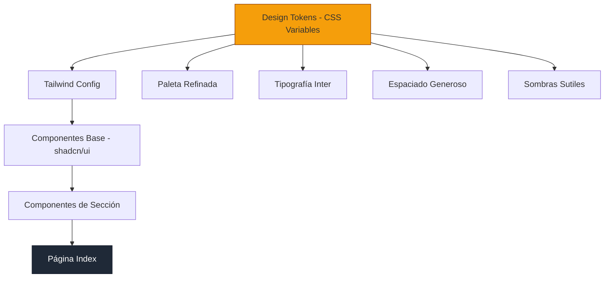

# Documento de Diseño: Rediseño Visual — Central de Taxis Girardot

## Resumen

Rediseño visual completo de la landing page de Central de Taxis Girardot. El objetivo es transformar la estética actual en una experiencia moderna, visual y minimalista, manteniendo el mismo contenido, imágenes, funcionalidad y stack tecnológico. Se refinará la paleta de colores (amarillo/negro), se implementará una tipografía más limpia, se aumentará el whitespace y se reducirán los elementos decorativos para lograr un diseño contemporáneo alineado con tendencias 2024/2025.

---

## Arquitectura Visual



---

## Principios de Diseño

### 1. Respirar (Whitespace Generoso)
- Padding de secciones: `py-24 lg:py-32` (antes `py-16`)
- Gaps entre elementos: mínimo `gap-8`, preferir `gap-12` a `gap-16`
- Contenido centrado con `max-w-6xl` en lugar de container completo
- Separación entre secciones mediante espacio, no bordes ni líneas

### 2. Impacto (Tipografía Bold)
- Headings grandes: `text-5xl lg:text-7xl` para hero, `text-4xl lg:text-5xl` para secciones
- Peso fuerte en títulos: `font-bold` o `font-extrabold`
- Body text más pequeño y ligero: `text-base` con `font-normal`
- Contraste extremo entre heading y body para jerarquía clara

### 3. Foco (Un CTA por Sección)
- Cada sección tiene máximo un call-to-action principal
- CTAs secundarios son sutiles (ghost o link)
- Eliminar redundancia de botones
- Guiar el ojo del usuario con un solo punto focal por viewport

### 4. Elegancia (Detalles Refinados)
- Bordes sutiles en lugar de sombras pesadas
- Transiciones suaves (`duration-500` con `ease-out`)
- Esquinas redondeadas consistentes (`rounded-2xl` para cards, `rounded-full` para botones primarios)
- Iconos monocromáticos con acento de color mínimo

---

## Paleta de Colores Refinada

### Colores Principales

| Token | Actual | Nuevo | Descripción |
|-------|--------|-------|-------------|
| `--primary` | `48 100% 50%` (amarillo puro) | `43 96% 56%` (ámbar dorado) | Más sofisticado, menos "neón" |
| `--primary-foreground` | `0 0% 0%` | `20 14% 10%` | Negro cálido en lugar de puro |
| `--background` | `0 0% 100%` (blanco puro) | `40 33% 99%` | Blanco cálido casi imperceptible |
| `--foreground` | `210 40% 3.9%` | `20 14% 12%` | Gris muy oscuro cálido |
| `--muted` | `210 40% 96.1%` | `40 20% 96%` | Gris cálido para fondos alternos |
| `--muted-foreground` | `215.4 16.3% 46.9%` | `20 10% 50%` | Gris medio cálido |
| `--border` | `214.3 31.8% 91.4%` | `40 10% 92%` | Borde cálido sutil |
| `--card` | `0 0% 100%` | `40 33% 99%` | Mismo que background |

### Nuevos Tokens

| Token | Valor | Uso |
|-------|-------|-----|
| `--surface` | `40 20% 97%` | Fondo alternativo para secciones |
| `--surface-elevated` | `0 0% 100%` | Cards elevadas sobre surface |
| `--primary-soft` | `43 96% 95%` | Fondo sutil con tinte primario |
| `--text-heading` | `20 14% 8%` | Color específico para headings |
| `--text-body` | `20 10% 40%` | Color específico para body text |

---

## Sistema Tipográfico

### Fuente: Inter

```typescript
// tailwind.config.ts
fontFamily: {
  sans: ['Inter', 'system-ui', '-apple-system', 'sans-serif'],
}
```

### Escala Tipográfica

| Elemento | Clase | Peso | Tracking |
|----------|-------|------|----------|
| Hero H1 | `text-5xl sm:text-6xl lg:text-7xl` | `font-extrabold` | `tracking-tight` |
| Section H2 | `text-4xl lg:text-5xl` | `font-bold` | `tracking-tight` |
| Card H3 | `text-xl lg:text-2xl` | `font-semibold` | normal |
| Body Large | `text-lg` | `font-normal` | normal |
| Body | `text-base` | `font-normal` | normal |
| Caption | `text-sm` | `font-medium` | normal |
| Overline | `text-xs uppercase` | `font-semibold` | `tracking-widest` |

---

## Sistema de Layout

### Ritmo de Secciones

```
Header (fixed, h-20, glassmorphism)
├── Hero (full-viewport, imagen de fondo)
├── Servicios (surface background, py-24)
├── Contacto (white background, py-24)
├── Beneficios (surface background, py-24)
├── Flota (white background, py-24)
├── Nosotros (surface background, py-24)
├── Testimonios (white background, py-24)
├── Mapa + Conductor (surface background, py-24)
└── Footer (dark background)
```

### Contenedores

- Max-width principal: `max-w-7xl` (1280px)
- Max-width contenido texto: `max-w-3xl` (768px)
- Padding horizontal: `px-6 lg:px-8`
- Sección padding vertical: `py-24 lg:py-32`

---

## Lenguaje de Componentes

### Cards
- **Antes**: `taxi-card` con `shadow-md hover:shadow-lg border border-border/50`
- **Después**: `bg-surface-elevated rounded-2xl p-8 lg:p-10 border border-border/50 hover:border-primary/20 transition-all duration-500`
- Sin sombras por defecto, borde sutil
- Hover: borde con tinte primario, sin elevación

### Botones
- **Primario (CTA)**: `rounded-full px-8 py-4 bg-primary text-primary-foreground font-semibold`
- **Secundario**: `rounded-full px-8 py-4 border-2 border-foreground/20 text-foreground hover:border-primary`
- **Ghost**: `text-primary font-medium hover:underline underline-offset-4`
- Eliminar `transform hover:-translate-y` (demasiado "juguetón" para minimalismo)

### Iconos
- Tamaño reducido: `h-5 w-5` en lugar de `h-8 w-8`
- Color: `text-foreground/60` por defecto, `text-primary` solo para énfasis
- Contenedores de icono: `w-12 h-12 rounded-xl bg-primary-soft flex items-center justify-center`

### Badges/Tags
- `text-xs uppercase tracking-widest font-semibold text-primary`
- Sin fondo, solo texto con color primario como overline

---

## Rediseño Sección por Sección

### Header

**Enfoque actual**: Fondo blanco sólido, logo + nav + 2 CTAs  
**Nuevo enfoque**: Glassmorphism minimalista

```typescript
// Cambios clave
className="fixed top-0 left-0 right-0 z-50 bg-white/80 backdrop-blur-xl border-b border-border/30"
// Altura: h-20 (antes h-16)
// Logo más pequeño: h-12 (antes h-16)
// Nav links: text-sm font-medium text-foreground/70 hover:text-foreground
// Solo 1 CTA visible: "Pide tu Taxi" (rounded-full, bg-primary)
// Eliminar botón "Llama Ahora" del header (queda en hero)
```

### Hero Section

**Enfoque actual**: Imagen con overlay oscuro, texto izquierda, 2 CTAs grandes, 3 stat cards  
**Nuevo enfoque**: Full-screen inmersivo, tipografía dominante, un solo CTA

```typescript
// Estructura:
// - Imagen full-screen con overlay gradient más sutil
// - Overlay: from-black/60 via-black/30 to-black/10 (menos pesado)
// - Título centrado o izquierda: text-5xl sm:text-6xl lg:text-7xl font-extrabold tracking-tight
// - Subtítulo: text-lg sm:text-xl text-white/80 max-w-xl (más corto, más elegante)
// - Un solo CTA principal: rounded-full, grande, con ícono WhatsApp
// - Stats: mover abajo como strip horizontal sutil, no cards glassmorphism
// - Eliminar gradient-to-white inferior, usar transición natural
```

### Servicios

**Enfoque actual**: Grid 3 columnas, cards con iconos circulares grandes  
**Nuevo enfoque**: Cards minimalistas con iconos pequeños

```typescript
// - Overline: "NUESTROS SERVICIOS" (text-xs uppercase tracking-widest text-primary)
// - Título: text-4xl lg:text-5xl font-bold tracking-tight
// - Cards: border sutil, padding generoso (p-8), sin sombra
// - Iconos: w-12 h-12 rounded-xl bg-primary-soft (no circulares)
// - Hover: border-primary/30 transition-colors duration-500
// - Sin hover:scale (demasiado agresivo para minimalismo)
```

### Contacto (Reserva)

**Enfoque actual**: 2 columnas (info + form), muchos botones de teléfono  
**Nuevo enfoque**: Form prominente, info condensada

```typescript
// - Form como protagonista: card elevada con p-10 lg:p-12
// - Info de contacto: lista compacta con iconos inline (no cards separadas)
// - Reducir botones de teléfono: mostrar solo 2 principales
// - WhatsApp: un solo botón prominente
// - Form inputs: border-0 bg-surface rounded-xl (estilo moderno sin borde visible)
// - Submit button: rounded-full, full-width
```

### Beneficios

**Enfoque actual**: Grid 6 cards + imagen con overlay + stat flotante  
**Nuevo enfoque**: Layout asimétrico, menos cards

```typescript
// - Grid 2x3 con cards más grandes y espaciadas
// - Cards: solo icono + título + descripción, sin fondo de icono circular
// - Icono: text-primary, tamaño h-6 w-6, alineado a la izquierda (no centrado)
// - Imagen: full-width con rounded-3xl, sin stat card flotante
// - Stat "98%": integrar como texto sobre la imagen o eliminar
```

### Flota

**Enfoque actual**: Imagen + 2 cards de vehículos + CTA  
**Nuevo enfoque**: Imagen dominante con info superpuesta

```typescript
// - Imagen hero-style: h-[500px] rounded-3xl overflow-hidden
// - Overlay con texto mínimo
// - Tipos de vehículo: horizontal strip debajo, no cards
// - Cada tipo: icono + nombre + capacidad en una línea
// - CTA: ghost button "Ver más →" en lugar de botón grande
```

### Nosotros

**Enfoque actual**: Historia + stats grid + misión/visión cards  
**Nuevo enfoque**: Narrativa limpia con números destacados

```typescript
// - Layout: texto a la izquierda, stats a la derecha (mantener)
// - Stats: números grandes (text-5xl font-extrabold) sin card, solo número + label
// - Misión/Visión: simplificar a un solo bloque con tabs o accordion
// - Eliminar iconos decorativos de misión/visión
// - Fondo: surface sutil, sin gradients
```

### Testimonios

**Enfoque actual**: Grid 3 cards con estrellas + foto + texto  
**Nuevo enfoque**: Testimonios grandes, uno a la vez o slider

```typescript
// - Un testimonio destacado grande (text-2xl italic)
// - Foto circular más grande: w-16 h-16
// - Estrellas: más pequeñas, color primary sutil
// - Sin card visible: solo contenido con separador sutil
// - Alternativa: layout horizontal con scroll
```

### Mapa + Formulario Conductor

**Enfoque actual**: 2 columnas (mapa + form card)  
**Nuevo enfoque**: Mantener layout, refinar estética

```typescript
// - Mapa: rounded-2xl con border sutil
// - Form: misma estructura pero con estilo actualizado (inputs sin borde, bg-surface)
// - Badge "SERVICIO ACTIVO 24/7": más sutil, text-sm
// - Eliminar animate-pulse del indicador verde (demasiado llamativo)
```

### Footer

**Enfoque actual**: 3 columnas (info + links + social)  
**Nuevo enfoque**: Minimalista, una sola línea o dos filas

```typescript
// - Fondo: bg-foreground (casi negro cálido)
// - Layout: centrado, logo + links en una fila
// - Links: text-sm text-white/60 hover:text-white
// - Copyright: centrado abajo, text-xs text-white/40
// - Facebook: icono sutil, no botón grande
// - Eliminar descripción larga, solo essentials
```

### Elementos Flotantes (WhatsApp + Facebook + ScrollToTop)

**Enfoque actual**: Botones circulares con sombra, animate-pulse  
**Nuevo enfoque**: Más sutiles, glassmorphism

```typescript
// - WhatsApp: mantener pero con bg-green-500/90 backdrop-blur-sm
// - Eliminar punto rojo animate-pulse (distrae)
// - Facebook: mover al footer, eliminar botón flotante
// - ScrollToTop: más pequeño, bg-foreground/80 backdrop-blur-sm text-white
// - Posición: bottom-8 right-8 (más separado del borde)
```

---

## Diseño de Bajo Nivel

### Cambios en CSS Variables (`src/index.css`)

```css
:root {
  /* Paleta refinada */
  --background: 40 33% 99%;
  --foreground: 20 14% 12%;
  --card: 0 0% 100%;
  --card-foreground: 20 14% 12%;
  --popover: 0 0% 100%;
  --popover-foreground: 20 14% 12%;
  
  /* Ámbar dorado en lugar de amarillo puro */
  --primary: 43 96% 56%;
  --primary-foreground: 20 14% 10%;
  
  /* Negro cálido */
  --secondary: 20 14% 10%;
  --secondary-foreground: 40 33% 99%;
  
  --muted: 40 20% 96%;
  --muted-foreground: 20 10% 50%;
  
  --accent: 43 96% 56%;
  --accent-foreground: 20 14% 10%;
  
  --border: 40 10% 92%;
  --input: 40 10% 92%;
  --ring: 43 96% 56%;
  
  /* Nuevos tokens */
  --surface: 40 20% 97%;
  --surface-elevated: 0 0% 100%;
  --primary-soft: 43 96% 95%;
  --text-heading: 20 14% 8%;
  --text-body: 20 10% 40%;
  
  /* Taxi tokens actualizados */
  --taxi-yellow: 43 96% 56%;
  --taxi-yellow-dark: 38 92% 48%;
  --taxi-yellow-light: 43 96% 92%;
  --taxi-black: 20 14% 10%;
  --taxi-gray: 20 10% 50%;
  --taxi-light: 40 33% 99%;
  --primary-text: 38 92% 30%;
  
  /* Sombras refinadas */
  --shadow-card: 0 1px 3px 0 rgb(0 0 0 / 0.04), 0 1px 2px -1px rgb(0 0 0 / 0.04);
  --shadow-elevated: 0 4px 6px -1px rgb(0 0 0 / 0.05), 0 2px 4px -2px rgb(0 0 0 / 0.05);
  --shadow-button: none;
  
  /* Transiciones */
  --transition-smooth: all 0.5s cubic-bezier(0.4, 0, 0.2, 1);
  
  --radius: 1rem;
}
```

### Cambios en Tailwind Config (`tailwind.config.ts`)

```typescript
// Adiciones al theme.extend
fontFamily: {
  sans: ['Inter', 'system-ui', '-apple-system', 'BlinkMacSystemFont', 'sans-serif'],
},
colors: {
  // ... existentes ...
  surface: {
    DEFAULT: "hsl(var(--surface))",
    elevated: "hsl(var(--surface-elevated))",
  },
  "primary-soft": "hsl(var(--primary-soft))",
  "text-heading": "hsl(var(--text-heading))",
  "text-body": "hsl(var(--text-body))",
},
spacing: {
  '18': '4.5rem',
  '22': '5.5rem',
},
borderRadius: {
  '2xl': '1rem',
  '3xl': '1.5rem',
  '4xl': '2rem',
},
keyframes: {
  "fade-in": {
    from: { opacity: "0", transform: "translateY(20px)" },
    to: { opacity: "1", transform: "translateY(0)" },
  },
  "fade-in-up": {
    from: { opacity: "0", transform: "translateY(40px)" },
    to: { opacity: "1", transform: "translateY(0)" },
  },
  "slide-in-right": {
    from: { opacity: "0", transform: "translateX(20px)" },
    to: { opacity: "1", transform: "translateX(0)" },
  },
},
animation: {
  "fade-in": "fade-in 0.8s ease-out forwards",
  "fade-in-up": "fade-in-up 1s ease-out forwards",
  "slide-in-right": "slide-in-right 0.6s ease-out forwards",
},
```

### Clases de Componente Actualizadas

#### `.taxi-card` (Clase utilitaria global)

```css
/* Antes */
.taxi-card {
  @apply bg-card rounded-xl p-6 shadow-md hover:shadow-lg transition-all duration-300 border border-border/50;
}

/* Después */
.taxi-card {
  @apply bg-surface-elevated rounded-2xl p-8 lg:p-10 border border-border/50 hover:border-primary/20 transition-all duration-500;
}
```

#### `.section-padding` (Clase utilitaria global)

```css
/* Antes */
.section-padding {
  @apply px-4 sm:px-6 lg:px-8 py-16;
}

/* Después */
.section-padding {
  @apply px-6 lg:px-8 py-24 lg:py-32;
}
```

#### `.taxi-button` (Clase utilitaria global)

```css
/* Antes */
.taxi-button {
  @apply bg-primary text-primary-foreground hover:bg-primary/90 transition-all duration-300 font-semibold rounded-lg px-6 py-3 shadow-md hover:shadow-lg transform hover:-translate-y-0.5;
}

/* Después */
.taxi-button {
  @apply bg-primary text-primary-foreground hover:bg-primary/90 transition-all duration-500 font-semibold rounded-full px-8 py-4;
}
```

### Variantes de Button (`src/components/ui/button.tsx`)

```typescript
// Cambios en buttonVariants
const buttonVariants = cva(
  "inline-flex items-center justify-center gap-2 whitespace-nowrap text-sm font-medium ring-offset-background transition-all duration-500 focus-visible:outline-none focus-visible:ring-2 focus-visible:ring-ring focus-visible:ring-offset-2 disabled:pointer-events-none disabled:opacity-50 [&_svg]:pointer-events-none [&_svg]:size-4 [&_svg]:shrink-0",
  {
    variants: {
      variant: {
        default: "bg-primary text-primary-foreground hover:bg-primary/90 rounded-full",
        destructive: "bg-destructive text-destructive-foreground hover:bg-destructive/90 rounded-lg",
        outline: "border-2 border-foreground/20 bg-transparent text-foreground hover:border-primary hover:text-primary rounded-full",
        secondary: "bg-secondary text-secondary-foreground hover:bg-secondary/90 rounded-full",
        ghost: "hover:bg-accent/10 hover:text-accent-foreground rounded-lg",
        link: "text-primary underline-offset-4 hover:underline",
        hero: "bg-primary text-primary-foreground hover:bg-primary/90 font-bold rounded-full",
        whatsapp: "bg-green-500 text-white hover:bg-green-600 rounded-full",
        call: "bg-secondary text-secondary-foreground hover:bg-secondary/90 rounded-full",
      },
      size: {
        default: "h-11 px-6 py-2",
        sm: "h-9 px-4",
        lg: "h-13 px-8 py-4 text-base",
        icon: "h-10 w-10",
      },
    },
    defaultVariants: {
      variant: "default",
      size: "default",
    },
  },
);
```

### Nuevos Design Tokens CSS

```css
@layer components {
  /* Overline text style */
  .overline {
    @apply text-xs uppercase tracking-widest font-semibold text-primary;
  }
  
  /* Section heading combo */
  .section-heading {
    @apply text-4xl lg:text-5xl font-bold tracking-tight text-text-heading;
  }
  
  /* Section subheading */
  .section-subheading {
    @apply text-lg text-text-body max-w-2xl mx-auto mt-4;
  }
  
  /* Surface background for alternating sections */
  .bg-surface {
    @apply bg-[hsl(var(--surface))];
  }
  
  /* Elevated surface for cards */
  .bg-surface-elevated {
    @apply bg-[hsl(var(--surface-elevated))];
  }
  
  /* Icon container */
  .icon-container {
    @apply w-12 h-12 rounded-xl bg-[hsl(var(--primary-soft))] flex items-center justify-center;
  }
  
  /* Glassmorphism */
  .glass {
    @apply bg-white/80 backdrop-blur-xl border border-white/20;
  }
}
```

### Animaciones e Interacciones

#### Scroll-Triggered Fade In (con Intersection Observer)

```typescript
// Hook reutilizable: useScrollReveal
// Aplicar a cada sección con stagger en children
// Clase: opacity-0 translate-y-8 → opacity-100 translate-y-0
// Duration: 800ms, ease-out
// Threshold: 0.1 (trigger temprano)
```

#### Micro-interacciones

| Elemento | Interacción | Implementación |
|----------|-------------|----------------|
| Cards | Hover border color | `hover:border-primary/20 transition-colors duration-500` |
| Buttons | Hover opacity | `hover:bg-primary/90` (sin translate) |
| Nav links | Underline on hover | `hover:underline underline-offset-4` |
| Images | Subtle zoom on hover | `hover:scale-[1.02] transition-transform duration-700` |
| Floating buttons | Subtle pulse removed | Eliminar `animate-pulse` |
| Header | Blur on scroll | `backdrop-blur-xl` siempre activo |

#### Transiciones entre secciones

- Sin bordes ni líneas divisorias
- Alternancia de fondos: `bg-background` ↔ `bg-surface`
- Transición visual natural por contraste de fondo

---

## Estrategia de Testing

### Tests Visuales

- Verificar contraste WCAG AA en nueva paleta (ámbar sobre blanco, blanco sobre negro)
- Verificar que `--primary: 43 96% 56%` mantiene ratio 4.5:1 contra `--primary-foreground`
- Verificar legibilidad de `--text-body` sobre `--background`

### Tests de Propiedad Existentes

Los tests de propiedad existentes en `src/__tests__/properties/contrast.property.test.ts` deben seguir pasando con los nuevos valores de color. Actualizar los valores HSL en los tests si es necesario.

### Responsive

- Verificar que el nuevo spacing (`py-24 lg:py-32`) no causa scroll excesivo en mobile
- Header glassmorphism debe funcionar en todos los navegadores
- Cards con `p-8 lg:p-10` deben reducirse apropiadamente en mobile

---

## Consideraciones de Rendimiento

- **Inter font**: Cargar via `@fontsource/inter` (self-hosted) para evitar FOUT
- **Backdrop-blur**: Usar con moderación (solo header y floating buttons) — puede causar jank en dispositivos de gama baja
- **Animaciones**: Usar `will-change: transform` solo en elementos que realmente animan
- **Intersection Observer**: Reutilizar un solo observer para todas las secciones

---

## Dependencias

| Dependencia | Propósito | Acción |
|-------------|-----------|--------|
| `@fontsource/inter` | Fuente Inter self-hosted | Instalar |
| `tailwindcss-animate` | Animaciones (ya instalado) | Mantener |
| `lucide-react` | Iconos (ya instalado) | Mantener |
| `class-variance-authority` | Variantes de componentes (ya instalado) | Mantener |

---

## Correctness Properties

*A property is a characteristic or behavior that should hold true across all valid executions of a system—essentially, a formal statement about what the system should do. Properties serve as the bridge between human-readable specifications and machine-verifiable correctness guarantees.*

### Property 1: Contraste WCAG AA

*For any* par de colores (texto, fondo) definido en la paleta del sistema, el ratio de contraste debe ser ≥ 4.5:1 para texto normal y ≥ 3:1 para texto grande (≥ 18pt o ≥ 14pt bold).

**Validates: Requirements 14.1, 14.2, 14.3, 14.4**

### Property 2: Consistencia de tokens de color

*For any* valor de color usado en un componente TSX, dicho valor debe referenciar una CSS variable definida en `:root`, o pertenecer al conjunto de excepciones permitidas (`white`, `black`, `green-500` para WhatsApp).

**Validates: Requirements 1.2, 1.3**

### Property 3: Espaciado consistente de secciones

*For any* sección de contenido (excluyendo Header, Hero y Footer), el componente debe incluir padding vertical `py-24 lg:py-32` y padding horizontal `px-6 lg:px-8`.

**Validates: Requirements 3.1, 3.3**

### Property 4: Alternancia de fondos entre secciones

*For any* par de secciones consecutivas en la página, sus fondos deben alternar entre `bg-background` y `bg-surface` sin repetir el mismo fondo en secciones adyacentes.

**Validates: Requirement 3.4**

### Property 5: Consistencia de botones

*For any* botón con variante primary, secondary, hero, whatsapp o call, el estilo debe incluir `rounded-full`, no debe incluir `hover:-translate-y`, y debe usar `duration-500` para transiciones.

**Validates: Requirements 13.1, 13.2, 13.3**

### Property 6: Preservación de imágenes

*For any* imagen del conjunto requerido (`hero-taxi.jpg`, `taxi-fleet.jpg`, `taxi-fleet-multiple.jpg`, `testimonial-ana.jpg`, `testimonial-carlos.jpg`, `testimonial-maria.jpg`), dicha imagen debe seguir siendo referenciada en su componente original.

**Validates: Requirement 16.1**

### Property 7: Preservación funcional

*For any* enlace (`href`), formulario (`onSubmit`), o elemento interactivo presente en la página, su funcionalidad (URL destino, endpoint de webhook, handler de evento) debe permanecer idéntica después del rediseño.

**Validates: Requirements 16.2, 16.4, 16.5**

### Property 8: Restricción de backdrop-blur

*For any* componente que no sea Header ni botón flotante (WhatsApp, ScrollToTop), dicho componente no debe usar la propiedad `backdrop-blur` en ninguna de sus variantes.

**Validates: Requirement 15.2**