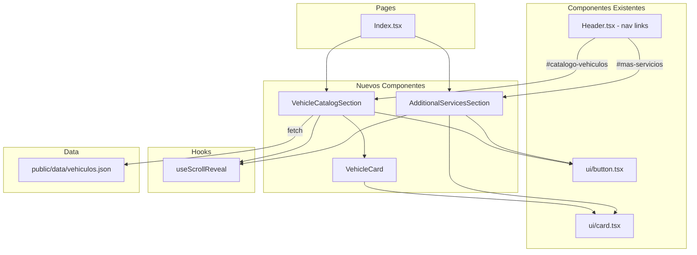
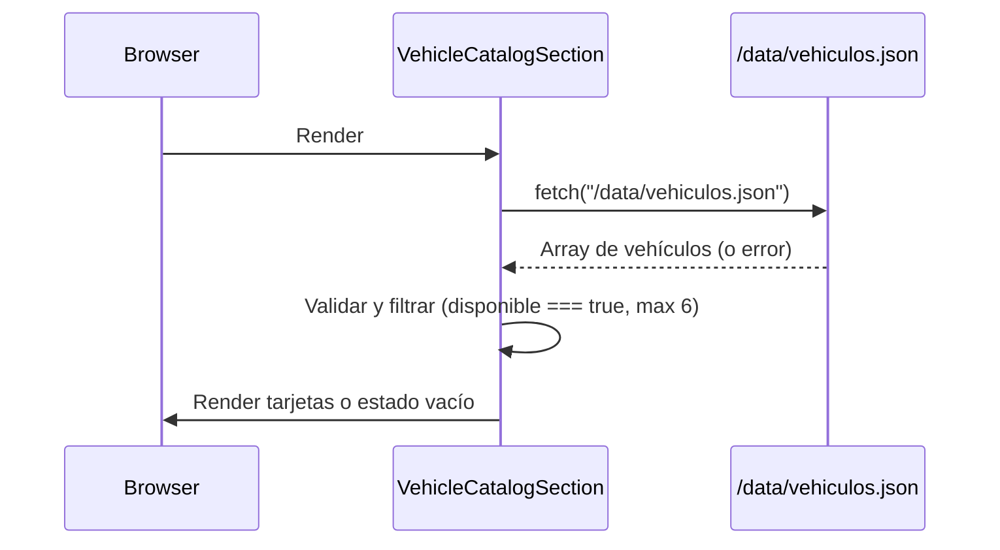

# Design Document: Servicios y Catálogo de Vehículos

## Overview

Este diseño extiende la landing page de Central de Taxis Girardot con dos nuevas secciones:

1. **Servicios Adicionales** — Sección informativa con 6 tarjetas que muestran servicios complementarios (SOAT, trámites, crédito vehicular, etc.) con un CTA a WhatsApp.
2. **Catálogo de Vehículos** — Sección que muestra hasta 6 vehículos disponibles para la venta, consumidos desde un archivo JSON estático en `public/data/vehiculos.json`.

Ambas secciones se insertan entre `ServicesSection` y `BenefitsSection` en `Index.tsx`, reutilizan los design tokens existentes (CSS variables HSL), componentes shadcn/ui (`Card`), el hook `useScrollReveal`, y los patrones de layout responsivo con Tailwind ya establecidos.

No se requiere backend ni API: el catálogo se sirve como archivo estático y se actualiza vía deploy en Vercel.

## Architecture



**Flujo de datos del catálogo:**



## Components and Interfaces

### 1. AdditionalServicesSection

**Archivo:** `src/components/AdditionalServicesSection.tsx`

Componente de sección que renderiza una grilla de 6 tarjetas de servicios con un CTA de WhatsApp.

```typescript
// No recibe props — los servicios son datos estáticos internos
const AdditionalServicesSection: React.FC = () => { ... }
```

**Responsabilidades:**
- Renderizar título con `<h2>` y subtítulo
- Mostrar 6 tarjetas de servicios con iconos lucide-react y títulos `<h3>`
- Incluir CTA de WhatsApp con aria-label apropiado
- Aplicar `useScrollReveal` al contenedor
- Exponer `id="mas-servicios"` en el `<section>` raíz
- Layout responsivo: 1 col (<768px), 2 cols (768–1023px), 3 cols (≥1024px)

**Estructura interna de datos:**
```typescript
interface ServiceItem {
  icon: LucideIcon;
  title: string; // max 40 caracteres
}

const services: ServiceItem[] = [
  { icon: Car, title: "Venta de vehículos nuevos y usados" },
  { icon: FileText, title: "Trámites ante el tránsito" },
  { icon: Recycle, title: "Chatarrización" },
  { icon: CreditCard, title: "Crédito para compra de vehículo" },
  { icon: Shield, title: "Venta de SOAT" },
  { icon: ShieldCheck, title: "Seguros todo riesgo" },
];
```

### 2. VehicleCatalogSection

**Archivo:** `src/components/VehicleCatalogSection.tsx`

Componente de sección que carga el JSON de vehículos y renderiza las tarjetas filtradas.

```typescript
const VehicleCatalogSection: React.FC = () => { ... }
```

**Responsabilidades:**
- Hacer `fetch` de `/data/vehiculos.json` en un `useEffect`
- Validar cada entrada con `validateVehicle()`
- Filtrar por `disponible === true` y limitar a los primeros 6
- Mostrar estado vacío si no hay vehículos válidos o el fetch falla
- Aplicar `useScrollReveal` al contenedor
- Exponer `id="catalogo-vehiculos"` en el `<section>` raíz
- Layout responsivo: 1 col (<640px), 2 cols (640–1023px), 3 cols (≥1024px)
- Incluir CTA de WhatsApp

### 3. VehicleCard

**Archivo:** `src/components/VehicleCard.tsx`

Componente presentacional para un vehículo individual.

```typescript
interface VehicleCardProps {
  vehicle: Vehicle;
}

const VehicleCard: React.FC<VehicleCardProps> = ({ vehicle }) => { ... }
```

**Responsabilidades:**
- Mostrar imagen con alt text `"[marca] [modelo] [año]"` (max 125 chars)
- Mostrar marca, modelo, año y tipo de combustible
- Manejar error de carga de imagen con placeholder
- Usar `Card`, `CardHeader`, `CardContent` de shadcn/ui
- Heading `<h3>` para el nombre del vehículo

### 4. Header (modificación)

**Archivo:** `src/components/Header.tsx`

Agregar un item de navegación "Más Servicios" apuntando a `#mas-servicios`, posicionado inmediatamente después de "Servicios" tanto en `navItems` como en `allNavItems`.

### 5. Utilidad de validación

**Archivo:** `src/lib/vehicleValidation.ts`

Funciones puras para validar las entradas del JSON del catálogo.

```typescript
export interface Vehicle {
  id: string;
  marca: string;
  modelo: string;
  anio: number;
  tipoCombustible: "gasolina" | "diesel" | "gas" | "eléctrico" | "híbrido";
  foto: string;
  disponible: boolean;
}

export function validateVehicle(entry: unknown): Vehicle | null;
export function parseVehicleCatalog(data: unknown): Vehicle[];
```

## Data Models

### Vehicle (interfaz TypeScript)

| Campo            | Tipo     | Restricciones                                                     |
|------------------|----------|-------------------------------------------------------------------|
| `id`             | string   | Único, max 36 caracteres                                          |
| `marca`          | string   | Max 50 caracteres                                                 |
| `modelo`         | string   | Max 50 caracteres                                                 |
| `anio`           | number   | Entero, entre 2000 y el año actual inclusive                      |
| `tipoCombustible`| string   | Enum: `"gasolina"` \| `"diesel"` \| `"gas"` \| `"eléctrico"` \| `"híbrido"` |
| `foto`           | string   | URL absoluta (`http://` o `https://`) o ruta relativa (`/...`)    |
| `disponible`     | boolean  | `true` para mostrar en catálogo                                   |

### ServiceItem (tipo interno)

| Campo   | Tipo        | Restricciones            |
|---------|-------------|--------------------------|
| `icon`  | LucideIcon  | Componente de lucide-react |
| `title` | string      | Max 40 caracteres        |

### Archivo JSON de ejemplo (`public/data/vehiculos.json`)

```json
[
  {
    "id": "v001",
    "marca": "Chevrolet",
    "modelo": "Spark GT",
    "anio": 2020,
    "tipoCombustible": "gasolina",
    "foto": "https://example.com/spark-gt.jpg",
    "disponible": true
  },
  {
    "id": "v002",
    "marca": "Kia",
    "modelo": "Picanto",
    "anio": 2019,
    "tipoCombustible": "gasolina",
    "foto": "/images/picanto.jpg",
    "disponible": false
  }
]
```

## Correctness Properties

*A property is a characteristic or behavior that should hold true across all valid executions of a system — essentially, a formal statement about what the system should do. Properties serve as the bridge between human-readable specifications and machine-verifiable correctness guarantees.*

### Property 1: Vehicle validation accepts valid entries and rejects invalid ones

*For any* object that conforms to the Vehicle schema (id: string ≤36 chars, marca: string ≤50 chars, modelo: string ≤50 chars, anio: integer 2000–current year, tipoCombustible: one of the 5 valid values, foto: string starting with "http://", "https://", or "/", disponible: boolean), `validateVehicle` SHALL return a valid Vehicle object. *For any* object that violates at least one constraint (missing field, wrong type, out-of-range value, invalid foto format), `validateVehicle` SHALL return `null`.

**Validates: Requirements 4.2, 4.5, 4.7**

### Property 2: Catalog filtering preserves only available vehicles

*For any* array of valid Vehicle objects passed to `parseVehicleCatalog`, the returned array SHALL contain exactly those vehicles where `disponible === true`, in the same relative order as the input, and no vehicle with `disponible === false` SHALL appear in the result.

**Validates: Requirements 3.1, 4.4**

### Property 3: Catalog display is capped at 6 vehicles

*For any* array of available vehicles (length 0–50) returned from filtering, the displayed result SHALL contain at most 6 vehicles. Specifically, the result length SHALL equal `min(availableCount, 6)`, and those 6 SHALL be the first 6 in the filtered order.

**Validates: Requirements 3.3**

### Property 4: Alt text follows the accessibility pattern

*For any* valid Vehicle object, the generated alt text SHALL match the pattern `"${marca} ${modelo} ${anio}"` and SHALL have a length of at most 125 characters.

**Validates: Requirements 6.1**

## Error Handling

| Escenario | Comportamiento esperado |
|-----------|------------------------|
| `fetch` de `vehiculos.json` falla (red, 404, timeout) | Mostrar estado vacío: "No hay vehículos disponibles en este momento" |
| Archivo JSON contiene JSON inválido (parse error) | Capturar error en `try/catch`, mostrar estado vacío |
| Entrada de vehículo con campo faltante o tipo incorrecto | `validateVehicle` retorna `null`, la entrada se omite silenciosamente |
| Todas las entradas son inválidas | `parseVehicleCatalog` retorna `[]`, se muestra estado vacío |
| Archivo JSON está vacío (`[]`) | Se muestra estado vacío |
| Imagen de vehículo no carga (error de red o URL rota) | Handler `onError` en `` reemplaza con placeholder SVG/div indicando "Sin foto disponible" |
| URL de foto no cumple formato esperado | `validateVehicle` retorna `null`, la entrada se omite |

**Estrategia general:** Nunca crashear la aplicación por datos incorrectos del catálogo. Degradar gracefully mostrando el estado vacío o omitiendo entradas individuales.

## Testing Strategy

### Property-Based Tests (fast-check + vitest)

El proyecto ya tiene `fast-check` v4.7.0 como dev dependency y `vitest` configurado. Las funciones puras de validación (`validateVehicle`, `parseVehicleCatalog`) y la lógica de generación de alt text son candidatas ideales para PBT.

**Configuración:**
- Biblioteca: `fast-check` (ya instalada)
- Runner: `vitest` (ya configurado)
- Mínimo 100 iteraciones por propiedad
- Ubicación: `src/__tests__/properties/vehicleCatalog.property.test.ts`

**Propiedades a implementar:**

| Propiedad | Archivo bajo test | Generadores |
|-----------|-------------------|-------------|
| Property 1: Validation | `src/lib/vehicleValidation.ts` | Generar Vehicle válidos y objetos parciales/malformados |
| Property 2: Filtering | `src/lib/vehicleValidation.ts` | Generar arrays de Vehicle con disponible aleatorio |
| Property 3: Cap at 6 | `src/lib/vehicleValidation.ts` | Generar arrays de longitud 0–50 |
| Property 4: Alt text | `src/components/VehicleCard.tsx` (helper exportada) | Generar Vehicle válidos con strings de longitud variable |

**Tag format:** `Feature: servicios-y-catalogo-vehiculos, Property {N}: {texto}`

### Unit Tests (example-based)

| Test | Componente | Qué verifica |
|------|-----------|--------------|
| Renderiza 6 servicios | AdditionalServicesSection | 6 tarjetas presentes con títulos correctos |
| CTA WhatsApp correcto | AdditionalServicesSection | href, target, rel, aria-label |
| Heading hierarchy h2/h3 | AdditionalServicesSection | Semántica HTML |
| Imagen placeholder en error | VehicleCard | onError muestra placeholder |
| Estado vacío sin vehículos | VehicleCatalogSection | Mensaje "No hay vehículos disponibles en este momento" |
| Nav link "Más Servicios" | Header | Posición correcta y href="#mas-servicios" |
| JSON parse error no crashea | VehicleCatalogSection | Mock fetch con respuesta inválida |

### Integration Tests

| Test | Qué verifica |
|------|--------------|
| Orden de secciones en Index | ServicesSection → AdditionalServicesSection → VehicleCatalogSection → BenefitsSection |
| Navegación desde otra página | Click "Más Servicios" desde /tarifas navega a /#mas-servicios |

### Accessibility Tests

- Verificación de contraste con axe-core en CI (opcional, recomendado)
- Tab navigation manual en los CTA buttons
- Revisión de alt text en imágenes de vehículos

